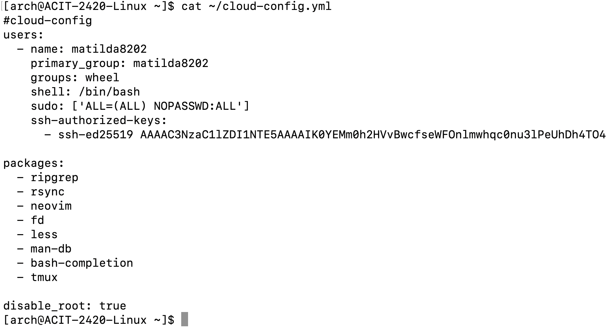

# Setting up a DigitalOcean droplet using `doctl` and `cloud-init`

## Table of Contents
- [Setting up a DigitalOcean droplet using `doctl` and `cloud-init`](#setting-up-a-digitalocean-droplet-using-doctl-and-cloud-init)
  - [Table of Contents](#table-of-contents)
  - [Introduction](#introduction)
    - [Prerequisites](#prerequisites)
  - [Installing and Setting up `doctl`](#installing-and-setting-up-doctl)
    - [To Install `doctl`](#to-install-doctl)
    - [Generating API token](#generating-api-token)
      - [To generate a personal access token](#to-generate-a-personal-access-token)
    - [Using the API token to grant account access to `doctl`](#using-the-api-token-to-grant-account-access-to-doctl)
    - [Validating `doctl` is working](#validating-doctl-is-working)
  - [Setting up a SSH key](#setting-up-a-ssh-key)
    - [Understanding SSH Keys](#understanding-ssh-keys)
    - [Generating SSH Key Pair](#generating-ssh-key-pair)
    - [Adding SSH Key to DigitalOcean](#adding-ssh-key-to-digitalocean)
  - [Configuring `cloud-init`](#configuring-cloud-init)
    - [What is `cloud-init`?](#what-is-cloud-init)
    - [Sample `cloud-init` Configuration File](#sample-cloud-init-configuration-file)
  - [Deploying the droplet](#deploying-the-droplet)
    - [Droplet Creation Command](#droplet-creation-command)
  - [Verifying everything worked](#verifying-everything-worked)
  - [References](#references)

## Introduction
This guide will show you how to create an Arch Linux droplet on DigitalOcean using `doctl` command-line tool and `cloud-init` (DigitalOcean, n.d.).
We will go step by step to set up SSH keys for secure access, and automate the setup process with `cloud-init`.

### Prerequisites
- A DigitalOcean account.
- A basic understanding of how to use the Linux command line.
- This guide assumes you already have an Arch Linux droplet and can SSH into it.

## Installing and Setting up `doctl`
`doctl` is the official DigitalOcean CLI (Command Line Interface) tool, and it makes it super easy to manage everything right from your terminal (DigitalOcean, n.d.).

### To Install `doctl`
On Arch Linux, install `doctl` with the pacman package manager. You can run:
```bash
sudo pacman -S doctl
```
This installs the `doctl` package on your Arch Linux system using the pacman package manager.

Here's a breakdown of the command:
* `sudo`: This command runs the following command with superuser (administrator) privileges. It is necessary for installing software and making system-level changes.
* `pacman`: This is the package manager for Arch Linux. It is used to install, remove, and manage software packages on Arch-based systems.
* `-S`: This option tells `pacman` to synchronize packages, specifically to install the package specified next.
* `doctl`: This is the name of the package you want to install. In this case, it refers to the official DigitalOcean command-line tool used for managing resources on DigitalOcean.


The screenshot above shows the installation of `doctl`.

### Generating API token
Before using `doctl`, you will have to give it access to your DigitalOcean account. In order to do that, you will need to generate an API token on the DigitalOcean website. This is the only step that needs to be done outside the Arch Linux droplet.

#### To generate a personal access token
  1. Log-in to your DigitalOcean Control Panel.
  2. On the left menu, click API (this takes you to the "Applications & API" page under the Tokens tab).
  3. In the Personal access tokens section, click the Generate New Token button.
  4. Give your token a name.
  5. Choose the preferred expiration date of your token.
  6. Click Full Access in the Scopes section.
  7. Then, click Generate Token.
  8. You will receive your own personal access Token just like the screenshot below.


### Using the API token to grant account access to `doctl`
Now that you have your API token, you can use it to link `doctl` to your DigitalOcean account. Here is what you should run:
```bash
doctl auth init
```
This command initializes the `doctl` tool by linking it to your DigitalOcean account, prompting you to enter your API token for authentication.

Here's a breakdown of the command:
* `auth`: This is a subcommand within `doctl` that deals with authentication. It manages how `doctl` connects to your DigitalOcean account.
* `init`: This command initializes the authentication process. It prompts you to enter your DigitalOcean API token, linking `doctl` to your account for subsequent operations.

Enter your access token to validate like the screenshot below.


### Validating `doctl` is working
To confirm that you have successfully linked `doctl` to your account, you can look at your account details by running:
```bash
doctl account get
```
This command retrieves and displays details about your DigitalOcean account, including the email associated with the account, droplet limits, and account status.

Here's a breakdown of the command:
* `account`: This subcommand refers to actions related to your DigitalOcean account, providing details and information about it.
* `get`: This command retrieves information about the currently authenticated account. It displays details such as the email address associated with the account, the droplet limit, and whether the email has been verified.

If successful, the output looks like:


## Setting up a SSH key
### Understanding SSH Keys
Secure Shell keys are great for secure, passwordless access to your server (Arch Linux, n.d.). SSH keys are a pair of cryptographic keys used for authenticating secure connections. Unlike passwords, SSH keys provide a more secure method of authentication as they are not transmitted over the network, making them resistant to brute-force attacks (Sobel, 2020). By using SSH keys, you can log in to your server without the need for a password, enhancing security.

### Generating SSH Key Pair
```bash
ssh-keygen -t ed25519 -f ~/.ssh/<key name> -C <youremail@email.com>
```
This command generates a new SSH key pair. Follow the prompts to save it in the default location.

Here's a breakdown of the command:
* `ssh-keygen`: This is the command used to generate a new SSH key pair.
* `-t ed25519`: The `-t` flag specifies the type of key to create. `ed25519` is the type of algorithm used for the SSH key.
* `-f ~/.ssh/<key name>`: This tells the system to sae the key files in the `~/.ssh/` directory under the given name `<key name>`. The tilde (`~`) represents the user's home directory, and `.ssh` is a hidden folder typically used to store SSH-related files.
* `-C <youremail@email.com>`: The `-C` flag is used to add a comment to the SSHkey for identification purposes. `<youremail@email.com>` is typically used as the comment, allowing you to easily identify the key.

After generating the key, the prompt will ask you to put in the passcode. Enter the same password and if successful, the output will show something like the screenshot below.


The screenshot above shows the generated SSH key.

### Adding SSH Key to DigitalOcean
Once your SSH key is generated, add it to your DigitalOcean account with:
```bash
doctl compute ssh-key import <digital ocean key name> --public-key-file ~/.ssh/<key name>.pub
```
Here’s a breakdown of the command:
* `compute ssh-key create`: `compute` is a category of `doctl` commands used to manage compute resources (like droplets) on DigitalOcean. `ssh-key import` is a subcommand under `compute` that imports an SSH public key into your DigitalOcean account, allowing you to use this key for authentication on droplets.
* `<digital ocean key name>`: This is the name or identifier you want to give to the SSH key within DigitalOcean for easy recognition. You can choose any name you like, and it will help you manage your keys, especially if you have multiple SSH keys associated with your account. This name will show up in the DigitalOcean control panel and API.
* `--public-key-file ~/.ssh/<key name>.pub`: `--public-key-file` is a flag that specifies the path to the public key file you want to import. `~/.ssh/<key name>.pub` is the file path to the SSH public key you are importing.
  

The screenshot above shows adding the SSH key.

## Configuring `cloud-init`
### What is `cloud-init`?
`cloud-init` is a tool used in cloud environments to automate the initial setup of virtual machine (Canonical, n.d.; DigitalOcean, n.d.). It allows users to configure settings like network configuration, user creation, and package installation during the first boot of the instance (Canonical, n.d.; Cloud-init, n.d.). This automation reduces manual setup time and ensures consistency across deployments.

### Sample `cloud-init` Configuration File
After you upload your public SSH key to your DigitalOcean account, you will have to create and open a `cloud-init` configuration file named `cloud-config.yml`.
To do that, run:
```bash
nvim ~/cloud-config.yml
```

Here’s a breakdown of the command:
* `nvim`: This is the command to start Neovim, a highly configurable text editor. It is commonly used in terminal environments, allowing users to create, edit, and manipulate text files. If Neovim is not installed on your system, this command will fail, and you'll need to install it first by running the command `sudo pacman -S neovim`.
* `~/cloud-config.yml`: This is the path to the file you want to open. `cloud-config.yml` is typically a configuration file used by `cloud-init` for automating cloud infrastructure. This file contains the configuration details that a cloud instance will use when it boots up.

Copy and paste the code below into your file by pressing i on your keyboard (this initiates the insert mode):
```bash
#cloud-config
users:
  - name: user-name
    primary_group: group-name
    groups: wheel
    shell: /bin/bash
    sudo: ['ALL=(ALL) NOPASSWD:ALL']
    ssh-authorized-keys:
      - ssh-ed25519 <your ssh public key string>

packages:
  - ripgrep
  - rsync
  - neovim
  - fd
  - less
  - man-db
  - bash-completion
  - tmux

disable_root: true
```

Here’s a breakdown of the command:
* `users`: This section specifies the user accounts to be created on the droplet.
* `- name: user-name`: Creates a user account with the specific username(`user-name`). This comment indicates that this should be replaced with the desired username.
* `primary_group: group-name`: Assigns the specified primary group to the user. This should be changed to the desired group name. The primary group determines the default group the user belongs to.
* `groups: wheel`: Adds the user to the `wheel` group, which is typically used in Unix-like systems to grant users the ability to use the `sudo` command. This allows the user to perfrom administrative tasks.
* `shell: /bin/bash`: Sets the user's default shell to `bash`, which is a common command-line interface in Linux environments.
* `sudo: ['ALL=(ALL) NOPASSWD:ALL']`: Configures the user to run any command with `sudo` without being prompted for a password. This can simplify automated scripts and commands that require administrative privileges.
* `ssh-authorized-keys:`: This section allows you to specify SSH public keys that are authorized for the user to log in without a password.
* `- ssh-ed25519 ...`: Specifies the SSH public key to be added for this user. The `ssh-ed25519` is a type of SSH key. The ellipsis (`...`) should be replaced with the actual public key.
* `packages:`: This section lists the packages that should be installed on the droplet during its initialization.
  - `- ripgrep`: A fast search tool that recursively searches your current directory for a regex pattern.
  - `- rsync`: A utility for efficiently transferring and synchronizing files across systems.
  - `- neovim`: An extensible text editor that serves as an improvement to the popular Vim editor.
  - `- fd`: A simple, fast, and user-friendly alternative to `find`, which helps locate files and directories.
  - `- less`: A terminal pager program that allows you to view (but not change) the contents of files one screen at a time.
  - `- man-db`: The manual page database for Linux, allowing you to view documentation about commands and programs using the `man` command.
  - `- bash-completion`: A package that provides command-line auto-completion for Bash, making it easier to work with commands and options.
  - `- tmux`: A terminal multiplexer that allows you to create and manage multiple terminal sessions within a single window.
* `disable_root: true`: Disables the root user account for security reasons, preventing direct root login and encouraing the use of the `sudo` command for adminitrative tasks instead.


The screenshot above shows inserting cloud-config code into the file.

After you have pasted the code above in your file, press ESC on your keyboard to exit INSERT mode. Then save and exit your file by typing `:wq` and pressing ENTER.

Once you are done with configuring your `cloud-config.yml` file, run the command:
```bash
cat ~/cloud-config.yml
```

Here’s a breakdown of the command:
* `cat`: Short for "concatenate," `cat` is a command-line utility that reads files and outputs their contents to the terminal. It's often used to view the content of text files.


The screenshot above shows a completed `cloud-init` configuration file.

## Deploying the droplet
Now that everything is configured, you're ready to deploy your Arch Linux droplet using `doctl` and the `cloud-init` configuration file.

### Droplet Creation Command
To create the droplets, run the following command:
``` bash
doctl compute droplet create --image <your custome image ID> --size s-1vcpu-1gb --ssh-keys <SSH key ID> --region <your preferred region slug> --user-data-file ~/cloud-config.yml --wait <droplet name>
```

Here’s a breakdown of the command:
* `doctl compute droplet create`: `compute` refers to DigitalOcean's compute resources. `droplet create` is an action to create a new Droplet (a virtual machine).
* `--image <your custom image ID>`: Specifies the image to use for the Droplet, such as a custom OS image you've uploaded. Replace `<your custom image ID>` with the ID of your image.
* `--size s-1vcpu-1gb`: Defines the Droplet's size,
`s-1vcpu-1gb` (Droplet with 1 virtual CPU and 1 GB RAM).
This is suitable for lightweight workloads.
* `--ssh-keys <SSH key ID>`: Adds the specified SSH key(s) to the Droplet for secure access. Replace `<SSH key ID>` with the actual ID of the SSH key you’ve already uploaded to DigitalOcean. You can find the SSH key IDs using `doctl compute ssh-key list`.
* `--region <your preferred region slug>`: Specifies the region where the Droplet will be created. Replace `<your preferred region slug>` with a valid region code, such as `nyc1` (New York), `sfo3` (San Francisco), or others depending on your preference.
* `--user-data-file ~/cloud-config.yml`: Defines the `cloud-init` file that will be used for provisioning and configuring the Droplet. This file contains automation scripts for setting up users, installing packages, configuring services, etc.
* `--wait`: Makes the command wait until the Droplet creation process is complete before exiting. Ensures the Droplet is ready to use after the command runs.
* `<droplet name>`: The name of the Droplet. Replace `<droplet name>` with the desired name for your Droplet (e.g., my-droplet).

After executing the command, the terminal will not display a prompt until the droplets finish deploying, which may take a few minutes. Once the deployment is successful, the output will resemble the following:
```bash
ID           Name              Public IPv4       Private IPv4    Public IPv6    Memory    VCPUs    Disk    Region    Image               VPC UUID                                Status    Tags    Features                            Volumes
311143987    second-droplet    203.0.113.199    203.0.113.4                     1024      1        25      nyc1      Ubuntu 22.04 x64    cfcbcc95-365a-4705-a18d-54abde1fc7b4    active            droplet_agent,private_networking
311912986    first-droplet     203.0.113.146    203.0.113.3                     1024      1        25      nyc1      Ubuntu 22.04 x64    cfcbcc95-365a-4705-a18d-54abde1fc7b4    active            droplet_agent,private_networking
```

## Verifying everything worked
Now that your Droplets are up and running, it's time to verify if everything is configured correctly by connecting via SSH.

First, you’ll need to retrieve the IPv4 address of your Droplet. Use the following command to list your running Droplets and find the relevant IP address:
```bash
doctl compute droplet list
```
This will display information about all of your Droplets, including their IPv4 addresses.

Once you have the IPv4 address, you can immediately connect to your Droplet using SSH. Run the following command, replacing the placeholders with your private key, username, and the Droplet’s IP address:
```bash
ssh -i ~/.ssh/<private key> <username>@<IPv4 address>
```
If everything is set up correctly, your terminal prompt should change, indicating a successful connection.

Congrats! You've successfully connected to your Droplet. 🎉 Now you can explore and manage your Droplets effortlessly.

## References
1. Arch Linux. (n.d.). *Installation guide*. Retrieved from [https://wiki.archlinux.org/title/Installation_guide](https://wiki.archlinux.org/title/Installation_guide)  
   In-text citation: (Arch Linux, n.d.)

2. Arch Linux. (n.d.). *SSH keys*. Retrieved from [https://wiki.archlinux.org/title/Secure_Shell#SSH_keys](https://wiki.archlinux.org/title/Secure_Shell#SSH_keys)  
   In-text citation: (Arch Linux, n.d.)

3. Canonical. (n.d.). *Cloud-init*. Retrieved from [https://cloud-init.readthedocs.io/en/latest/](https://cloud-init.readthedocs.io/en/latest/)  
   In-text citation: (Canonical, n.d.)

4. Chacon, S., & Straub, B. (2017). *Pro Git* (2nd ed.). Apress. Retrieved from [https://git-scm.com/book/en/v2](https://git-scm.com/book/en/v2)  
   In-text citation: (Chacon & Straub, 2017)

5. DigitalOcean. (n.d.). *How to create and manage SSH keys on DigitalOcean*. Retrieved from [https://www.digitalocean.com/docs/ssh/create-ssh-keys/](https://www.digitalocean.com/docs/ssh/create-ssh-keys/)  
   In-text citation: (DigitalOcean, n.d.-a)

6. DigitalOcean. (n.d.). *How to use cloud-init to configure a droplet*. Retrieved from [https://www.digitalocean.com/docs/droplets/how-to/use-cloud-init/](https://www.digitalocean.com/docs/droplets/how-to/use-cloud-init/)  
   In-text citation: (DigitalOcean, n.d.-b)

7. DigitalOcean. (n.d.). *How to Perform Initial Server Configuration with Cloud-Init*. Retrieved from [https://www.digitalocean.com/community/tutorials/how-to-use-cloud-config-for-your-initial-server-setup](https://www.digitalocean.com/community/tutorials/how-to-use-cloud-config-for-your-initial-server-setup)  
   In-text citation: (DigitalOcean, n.d.-c)

8. GNU. (n.d.). *Bash completion*. Retrieved from [https://bash-completion.alioth.debian.org/](https://bash-completion.alioth.debian.org/)  
   In-text citation: (GNU, n.d.)

9. OpenSSH. (n.d.). *SSH key management*. Retrieved from [https://www.openssh.com/manual.html](https://www.openssh.com/manual.html)  
   In-text citation: (OpenSSH, n.d.)

10. Sobel, M. (2020). *Learning Linux for iOS development: An introduction to Unix-based development for mobile applications*. Packt Publishing.  
    In-text citation: (Sobel, 2020)